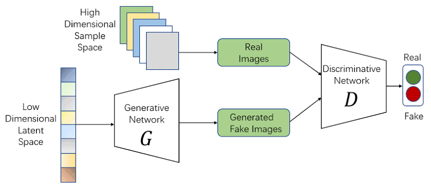

## Generative Adversarial Network (GAN)

## Important Note: Hardware & Time Requirements

This GAN training process is computationally intensive and time-consuming. The training time depends heavily on your hardware:

Recommended minimum hardware:

- NVIDIA GPU with 4GB+ VRAM
- 8GB+ system RAM
- TensorFlow with GPU support

If you don't have adequate hardware, consider using cloud platforms like:

- Google Colab (free GPU access)

- Kaggle Notebooks

- Google Cloud AI Platform

## Project Overview
In a GAN, the generator creates fake images, and the discriminator judges whether images are real or fake. The generator’s goal is to "fool" the discriminator into thinking its fake images are real.

**The two models are like rivals in a game:**

When the discriminator is good at spotting fakes, the generator needs to improve a lot.

When the discriminator is confused by fakes, the generator doesn’t need to improve as much.

## Dataset
consists of 60000 32x32 colour images in 10 classes, with 6000 images per class. There are 50000 training images and 10000 test images.

The dataset is divided into five training batches and one test batch, each with 10000 images. The test batch contains exactly 1000 randomly-selected images from each class. The training batches contain the remaining images in random order, but some training batches may contain more images from one class than another. Between them, the training batches contain exactly 5000 images from each class.

## Run the cells sequentially to:

Load and preprocess the CIFAR-10 dataset

Build the Generator and Discriminator models

Train the GAN

Generate and visualize  images

**Model Architecture**

## Generator

Uses transposed convolutional layers (Conv2DTranspose)

LeakyReLU activation functions

Batch normalization

Output: 32x32x3 RGB images

## Discriminator

Uses convolutional layers (Conv2D)

LeakyReLU activation functions

Dropout for regularization

Output: Binary classification (real/fake)

## Training Process

The training involves:

Sampling random noise as generator input

Generating fake images

Training discriminator on both real and fake images

Training generator to fool the discriminator

Repeating the process for multiple epochs

## Results

After training, the GAN can generate synthetic images that resemble the CIFAR-10 dataset. The quality improves with more training epochs.

## Hyperparameters

Learning rate: 0.0002

Batch size: 128

Epochs: 50-100 (adjustable)

Latent dimension: 100

Optimizer: Adam

## Acknowledgments
CIFAR-10 dataset provided by the Canadian Institute For Advanced Research